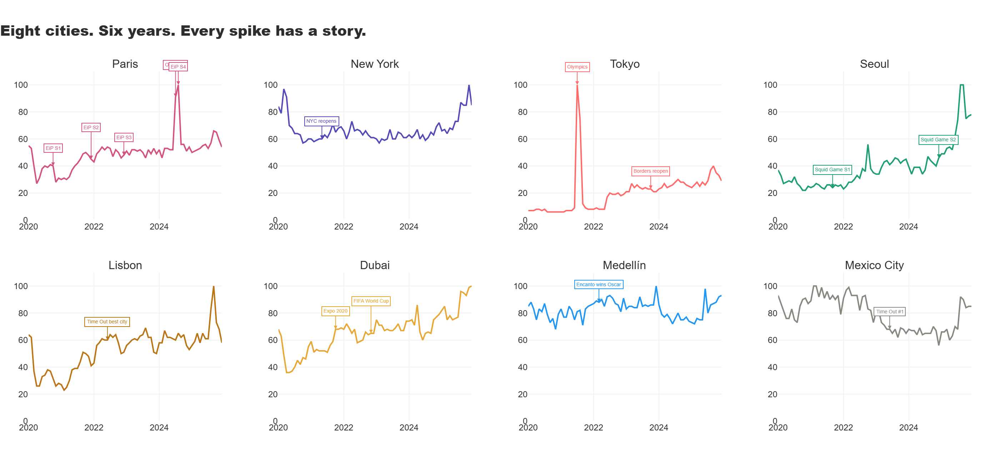

# Postcards & Profit
*Cities are brands. Google Trends is the brand tracker nobody hired.*

---

## The Hook

There is a specific kind of person who has seventeen tabs open 
about a city they are not visiting for another eight months. Who 
researches neighbourhoods the way other people research people. 
Who knows the difference between a city that is having a moment 
and a city that has become a feeling and understands that only 
one of them lasts.

This project is written by that person.

Cities are the world's most powerful brands and the least 
understood ones. Paris didn't become Paris because of a marketing 
campaign. Seoul didn't become the most searched city of its 
generation because someone decided it should. These things happen 
at the intersection of culture, timing, and a convergence of 
signals that the travel industry mostly notices after the fact, 
when the flights are full, the hotels are expensive, and the 
locals are tired of seeing the same content creator on every 
corner.

This project uses six years of Google Trends search interest 
across nine cities alongside international tourist arrival data 
to ask the question the industry keeps missing: does the data 
know before the crowds do?

---

## The Landscape



Nine cities. Six years. Every spike has a story. The COVID dip 
is visible in every chart. The recovery is not equal. Tokyo 
starts near zero because Japan kept its borders closed longer 
than almost any other country on earth. Medellín never drops 
below 68 because the world never stopped being curious about 
it. And Paris, the original city brand, sits quietly in the 
middle while everyone else fights for the top spot.

---

## What Makes This Different

- Does a Netflix show actually move search interest for a city and if so by how much and for how long?
- Which cities are showing early signs of overtourism fatigue before it becomes a headline?
- Where is the gap between where people search and where they actually go and what does that gap represent commercially?
- Which cities have positive momentum AND unmet demand right now — and what does that combination historically predict?
- Can you build a replicable framework for identifying destination opportunity before the travel industry notices?

---

## Key Findings

1. **The Netflix Effect is real but timing is everything.** Emily in Paris Season 1 dropped in October 2020 and Paris search interest fell by 7 points. The world was in lockdown. The show created desire. The pandemic cancelled the follow-through. Season 4 in August 2024 delivered +5.7 uplift. Same content. Different world. Completely different data.

2. **Rome got a 6.0 point uplift from a show that isn't even called Emily in Rome.** Season 4 Part 2 moved Emily to Rome for five episodes and Rome's search interest jumped by the same margin as Squid Game moved Seoul's. The city didn't need to be the star. It just needed a cameo in the right story.

3. **Squid Game Season 1 had zero uplift for Seoul.** South Korea's borders were effectively closed. The cultural moment was enormous. The travel intent had nowhere to go. Season 2 in December 2024, with open borders, delivered +6.0. The Netflix Effect only works when the airport is open.

4. **Paris at -57.2 on the Underdog Index is not unpopular. It is running on legacy.** People do not search Paris before they go to Paris. They just go. The arrivals have long since outpaced the intent signal because the decision was made decades ago and has been on autopilot ever since.

5. **Medellín has an Underdog Score of 82.4 and is still showing positive momentum.** Five years of consistently high search interest. Arrivals that have not caught up. A gap that represents unrealised demand at scale. That gap is not a failure. It is an opportunity with a very specific shape.

6. **Seoul is not the next city. Seoul is the current city.** Momentum of +31 points in six months. The arrivals are already following the interest. The opportunity window is closing.

---

## What A Travel Brand Should Do With This

**Destination Marketing Teams —** The Netflix Effect finding reframes the entire logic of content partnerships. Emily in Paris Season 1 failed to move Paris search interest not because the show underperformed but because the world was in lockdown. The show was not the variable. The border policy was. Any destination investing in content partnerships needs to model not just reach but travel accessibility at time of release.

**Hotel and Hospitality Groups —** The Underdog Index identifies cities where demand structurally exceeds supply. Medellín at 82.4, Dubai at 37.9, Mexico City at 32.5. These are not emerging markets in the traditional sense. They are established desire with infrastructure gaps. The hotel group that positions in Medellín before the connectivity catches up will benefit from the same dynamic that made Lisbon's early boutique hotels extraordinarily valuable between 2018 and 2022.

**Airline Route Planners —** Tokyo's recovery trajectory is the clearest case study in this dataset for demand that was suppressed rather than absent. Search interest was building throughout Japan's border closure. When the borders opened in October 2023 the line started climbing and has not stopped. The cities currently showing high search interest with low arrivals are the routes worth planning before the demand becomes obvious to everyone.

**Tourism Boards —** Medellín's plateau is a warning. Lisbon's plateau came with street protests about housing costs. The overtourism signal in this dataset is not a sudden collapse but a gradual flattening of rolling average interest that precedes the cultural narrative shift from "undiscovered gem" to "overcrowded". Catching that signal twelve months early is worth more than any reactive campaign.

---

## The Custom Metrics

**The Underdog Index**
Gap between average search interest and normalised tourist arrivals.
Positive score means searched more than arrivals justify. Negative score means arrivals exceed search interest.
`Underdog Score = Avg Interest (2020-2022) minus Normalised Arrivals (2019-2022)`

**Momentum Score**
Rate of change in search interest over the most recent six months versus the previous six months.
`Momentum = Recent 6-month avg minus Previous 6-month avg`

Both metrics are replicable for any city, any time period, any market.

---

## Project Structure
```
postcards-and-profit/
│
├── postcards_and_profit.ipynb      # Full annotated notebook
│
├── chart1_city_map                 # Nine cities, six years, every spike annotated
├── chart2_netflix_effect           # Paris, Rome and Seoul — the streaming impact
├── chart3_overtourism_signal       # Rolling averages — rising vs plateauing vs declining
├── chart4_underdog_index           # Search interest vs tourist arrivals gap
└── chart5_next_city                # Momentum vs unmet demand bubble chart
│
│   All charts saved as .png and interactive .html
```

---

## Tech Stack

| Tool | Purpose |
|---|---|
| Python | Core analysis |
| pandas + NumPy | Data manipulation and custom metric calculation |
| Plotly | Interactive charts |
| scipy | Statistical analysis |
| Google Trends | Search interest index — Worldwide, 2020-2025 |
| UN Tourism Data | International tourist arrivals by country, 2019-2022 |

---

## Data Sources

**Google Trends — Worldwide Interest Index 2020-2025**
Downloaded for nine cities: Paris, New York, Tokyo, Seoul, Lisbon, 
Dubai, Medellín, Mexico City and Rome. Google Trends measures search 
interest on a scale of 0-100 where 100 represents peak popularity 
within the selected period. All values are relative not absolute, 
which makes cross-city comparison methodologically honest. Search 
intent captured at the moment of decision, before the booking, 
before the flight, before the hotel. The earliest signal available.

**UN Tourism International Arrivals**
Annual international tourist arrivals by country from Our World in 
Data, sourced from UNWTO. Used to build the Underdog Index by 
comparing actual visitor volumes against search interest. Country 
level data mapped to city level for the nine cities in this analysis. 
Coverage 2019-2022, the most complete period available across all 
markets in this dataset.

---

## What I Learned

The Netflix Effect finding was the most surprising methodologically. 
I expected Emily in Paris to move Paris search interest consistently 
across all four seasons. The Season 1 data showing a negative uplift 
of -7.0 points forced a rethink. The show was not the variable. 
Border policy was. Once I controlled for travel accessibility the 
pattern became consistent — content drives intent but intent requires 
the belief that travel is actually possible. That reframe changed 
every subsequent analysis in this project.

The Underdog Index started as a simple ratio and became something 
more interesting when the negative scores appeared. Paris at -57.2 
was not a city failing the index. It was a city so established that 
the search intent is almost irrelevant to the arrival decision. 
That insight, that legacy brands operate outside normal demand 
signals, is commercially useful far beyond tourism and I did not 
plan for it. It came from the data.

The overtourism signal in Medellín is the finding I would most want 
to present to a travel brand. Not because it is the most technically 
sophisticated but because it is the most actionable. A city with 
five years of high search interest, positive momentum, and arrivals 
that have not yet caught up is a city where positioning now costs 
less than positioning after everyone else notices. The framework 
identifies that window. What happens inside it is a business decision.

Building this analysis across nine cities made it clear that the 
framework is more valuable than any individual finding. The Underdog 
Index, the momentum score, the Netflix Effect uplift calculation — 
none of these are findings tied to this dataset. They are tools. 
Point them at any city, any time period, any market, and they will 
tell you something worth knowing.

---

## About

**Trupthi Raj** — Data Analyst with seventeen tabs open about a 
city she is not visiting for another eight months and the framework 
to justify every single one of them.

[GitHub](https://github.com/trupthiraj) ·
[Tableau](https://public.tableau.com/app/profile/trupthi.raj/vizzes)
